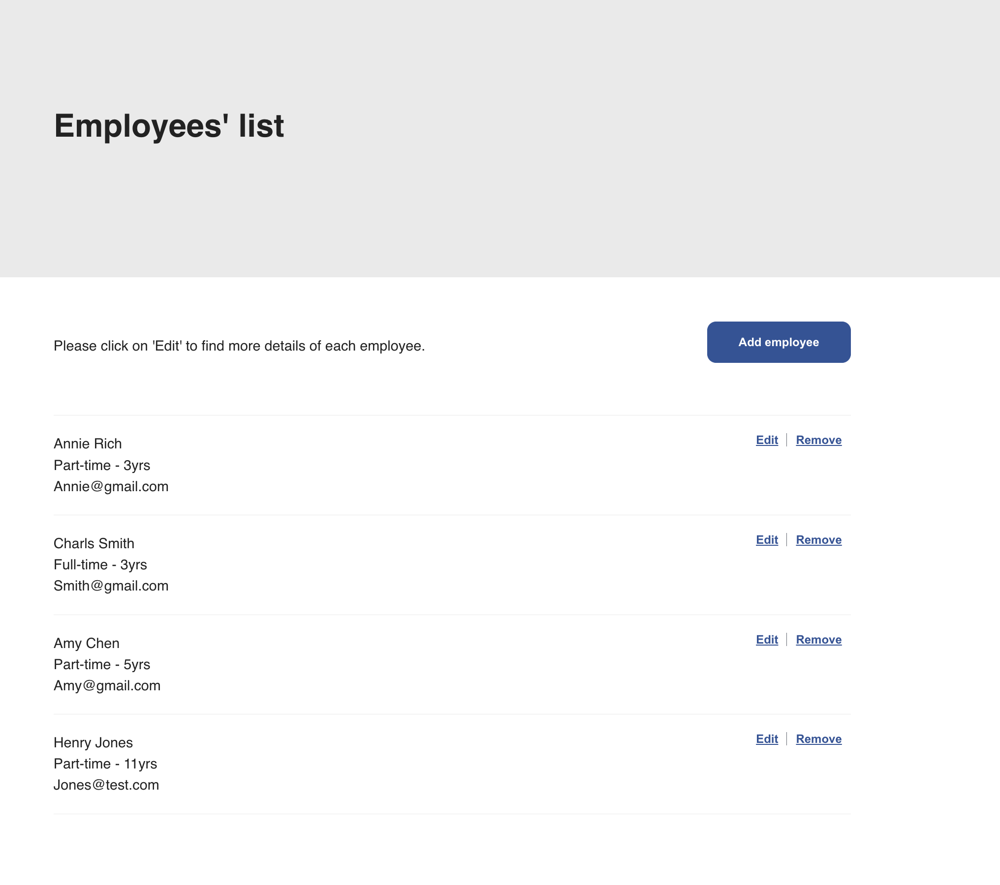

# Employee List App Project

The project was assigned to me to develop a full stack app where it showcases a list of employees and a user can create a new employee, view a list of all employees, modify existing employee records and finally delete employee records via an app.

This git hub repository mainly consists of two: frontend project folder named "employee-list" written in ReactJS and backend project folder called "employee-list-backend" written in Java.

## Project Brief

### Tech Stacks & Libraries

- ReactJS: I have developed my frontend in ReactJS to provide a user robust experience such as real-time update with Virtual DOM as well as to have a neat and modularised project structure.

- TypeScript: It's a suprset of JavaScript, and it provides strong typing check at the compiling time before executing codes so it helps developers to write with type safe.

- SCSS: Inline with ReactJS, SCSS works very well with modularised structured project to organise your code as well as it provides you to nest styling code, which is easy to work with.

- Java/Spring: It's a Java framework in Java to helps developers to get started with an auto configurable Spring application easily. It's easy to build, test, and deploy applications

### MVP

Summary:

We need a web application to create, list, modify and delete employees. The application should consist of a RESTful API (can be in .net core or any backend framework of your choice) and a React frontend. The schema for the employee is left to the criteria of the candidate.

## Technical Implementation

General:

I started building backend in Spring boot first. I decided to develop in Java as it's similar to c# as well as I have developed my fundamental of backed development in Java during \_nology course. Upon completion of backend, I have begun to built frontend in ReactJs and Typescript. This was my very first typescript project so it started a bit slow but I have managed to learn and pick the basics as I progressed. And finally, I have written unit testing with `vitest` at the end.

Specifics for Backend:

1. I have utilised `Model Mapper Class` to convert DTO to Entity or vice versa. This is because after setting up the basic CRUD methods, I realised that there are so many fields to instantiate the Entity and DTO with and it is efficient to take care of them indivisually making sure what values are converted ..etc. Also I learnt that returning DTO to Controller is better practice so I have done some research and found an easier way to help my situation, which is using Model Mapper Class. As a result I have created helper functions to convert classes between DTO and Entity so that I can reuse them at mutiple places.

2. To validate some of the important DTO, I have written some business logic in Service layer such as ensuring the names are capitalised and starting date is before the finish date. To follow the OOP abstraction concept, these helper functions are taken out from the Server layer methods.

Specifics for Frontend:

1. Form validation and dates fields were some of the aspects that I struggled with for the front-end.Since I have set the form fields validations up myself, the year fields for the start and finish date was a bit tricky especially for `type=number`(it's not available to set input value length) At the end, my validation logic to overcome this was to allow the input to be between the +-80years from the current years so that appropriate range of years are at least covered.

2. Unit testing script for the frontend was written in `vitest`. The testing script was written in TypeScript as well. Since I had issues with not resolving data with axio's get function and was unable to complete all of the unit tests on time.

## Reflection

1. This project taught me a lot especially the aspect of how to pick new concepts and libraries as you go especially under the condition that there is a limited time available for you to complete the project. Probably I'd imagine this could be one of the closest environment of actual work place. However it also taught me how to push myself by overcoming concerns and worries and keep going, which increased my focus level up to be more efficient and think logically what to do next during the project.

2. In my project, dates format (`LocalDate`) are handled as "dd-MM-yyyy". When I started a project in backend, I was focused on the frontend results to follow the Australian format. After combining the frontend and backend, it made me realised that date format should have followed `yyyy-MM-dd` format so that formatting and converting the dates field into other types or comparing could have been easier and less extra logic needed.

3. In the frontend, I have utilised `Context` to fetch the all employee data via API. Initially I had a logic to filter one employee from the all employee data locally for the 'Edit' button. However I have refactored and update it to use `findById` api fetch call so that you can always ensure to fetch the lated data of the specific employee. For this app, `Context` was not in need and `useEffect` on the specific component, however in general as the app gets bigger it's usually a better good to have the data fetched and stored in the `Context` to avoid prop drilling so I have leave it as is now.

## Future Goals

1. Completing all the testing for both frontend and backend. Currently working on the testing with JUnit and Mokito for the backend.

2. I would like to refactor my CRUD methods especially returned values from service layer to controller layer. At the moment I believe there are not enough indicator/response specified in the controller.

3. I also would like to refactor React code so that my functions are more testable and become pure. Also I'd like to refactor components restructure more unit testing aspects in mind.
